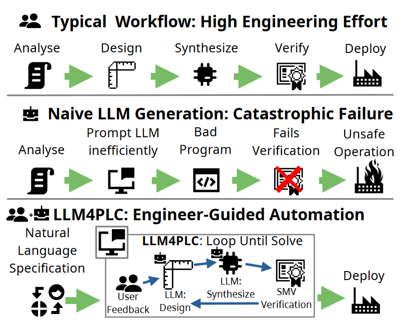

# LLM4PLC: Harnessing Large Language Models for Verifiable Model-Based Design in Industrial Control Systems
### Please refer to the project [website](https://sites.google.com/uci.edu/llm4plc/home) for the complete description and result showcase.

This research project aims to develop a novel approach to Model-Based Design (MBD) for Industrial Control Systems (ICS) by leveraging iterative prompting of Large Language Models (LLMs) to generate code for Programmable Logic Controllers (PLCs).
This repository contains published code, prompts, and descriptions of the LLM4PLC project.

## Architecture
To provide a high-level overview of the architecture of the LLM4PLC project, the following diagram is provided.

## Pre-Trained LoRAs
The pretrained loras are available [here](https://drive.google.com/file/d/1Z1XMpz9DJwcyJtPNyKRv8gVWspU0-DTo/view?usp=sharing). To use these, please refer to the instructions in [text-generation-webui](https://github.com/oobabooga/text-generation-webui).

##
Contributors:
Mohamad Fakih - mhfakih@uci.edu

Rahul Dharmaji - rdharmaj@uci.edu

Yasamin Moghaddas - ymoghadd@uci.edu
